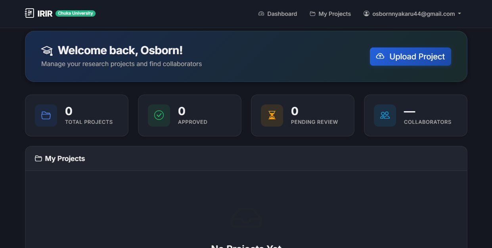

# irir


intelligent research and innovation repository (irir) is a spring boot web app for managing research projects and role-based review workflows for a university department.

the app uses thymeleaf for server-side rendering, spring security for authentication, and spring data jpa for persistence.



---

## at a glance

| item | value |
| --- | --- |
| app type | spring boot web app (thymeleaf) |
| java | 17 |
| build | maven |
| default db | mysql (application.properties) |
| dev db | h2 in-memory (application-h2.properties) |
| http port | 8080 |
| login | /login |
| register | /register |
| dashboard | /dashboard |

---

## core modules (from code)

- auth and registration flow for students
- role-based dashboards (student, supervisor, directorate, admin)
- project, review, similarity report, and audit log domain models
- jpa repositories for dashboard metrics and queries
- seed data initializer for default admin

---

## tech stack

- spring boot 3, spring web, spring security, thymeleaf
- spring data jpa + hibernate
- mysql connector (default)
- h2 database (dev profile)
- apache tika (document parsing)
- apache lucene (search)
- lombok, validation, mail, actuator

---

## project layout

- src/main/java/com/chuka/irir/config - security, mvc, and data initialization
- src/main/java/com/chuka/irir/controller - auth and dashboard controllers
- src/main/java/com/chuka/irir/model - domain entities and enums
- src/main/java/com/chuka/irir/repository - spring data repositories
- src/main/java/com/chuka/irir/service - user and security services
- src/main/resources/templates - thymeleaf views
- src/main/resources/application.properties - mysql config (default)
- src/main/resources/application-h2.properties - h2 config (dev)

---

## prerequisites

- java 17
- maven 3.9+

this repo can also run with the project-local toolchain if present:

- .jdk/jdk-17.0.18+8
- .maven/apache-maven-3.9.14

---

## quick start (h2, no mysql)

### windows powershell

option a: use project-local toolchain

```powershell
$env:JAVA_HOME="$PWD\.jdk\jdk-17.0.18+8"
$env:Path="$env:JAVA_HOME\bin;$env:Path"
& "$PWD\.maven\apache-maven-3.9.14\bin\mvn.cmd" spring-boot:run "-Dspring-boot.run.profiles=h2"
```

option b: use system java + maven

```powershell
mvn spring-boot:run "-Dspring-boot.run.profiles=h2"
```

### mac or linux

```bash
mvn spring-boot:run -Dspring-boot.run.profiles=h2
```

open:

- http://localhost:8080
- http://localhost:8080/h2-console (jdbc url: jdbc:h2:mem:irir_db)

---

## mysql mode (default)

1. start your mysql server.
2. ensure the database and credentials match application.properties.
3. run the app without the h2 profile.

### current mysql settings

```properties
spring.datasource.url=jdbc:mysql://localhost:3306/irir_db?createDatabaseIfNotExist=true&useSSL=false&serverTimezone=Africa/Nairobi&allowPublicKeyRetrieval=true
spring.datasource.username=root
spring.datasource.password=root
```

### sample mysql setup (optional)

```sql
create database if not exists irir_db;
create user if not exists 'irir'@'localhost' identified by 'irir';
grant all privileges on irir_db.* to 'irir'@'localhost';
flush privileges;
```

if you use the sample user, update application.properties to match:

```properties
spring.datasource.username=irir
spring.datasource.password=irir
```

### run with mysql

```powershell
$env:JAVA_HOME="$PWD\.jdk\jdk-17.0.18+8"
$env:Path="$env:JAVA_HOME\bin;$env:Path"
& "$PWD\.maven\apache-maven-3.9.14\bin\mvn.cmd" spring-boot:run
```

---

## build and run the jar

```powershell
$env:JAVA_HOME="$PWD\.jdk\jdk-17.0.18+8"
$env:Path="$env:JAVA_HOME\bin;$env:Path"
& "$PWD\.maven\apache-maven-3.9.14\bin\mvn.cmd" -DskipTests package
& "$env:JAVA_HOME\bin\java.exe" -jar "$PWD\target\irir-1.0.0-SNAPSHOT.jar" --spring.profiles.active=h2
```

---

## default admin (dev seed)

on first startup, a default admin is created if none exist:

- email: admin@chuka.ac.ke
- password: Admin@2024

change this password after first login.

---

## configuration notes

- file uploads go to the relative directory: uploads
- lucene index uses: lucene-index
- mail settings env vars: MAIL_USERNAME, MAIL_PASSWORD

---

## troubleshooting

- java_home not defined: set java 17 and ensure it is on your path
- mysql connection refused: start mysql or use the h2 profile
- port 8080 in use: change server.port in application.properties

---

## screenshots

- none yet (add images later in a /docs or /screenshots folder)

---

## license

mit license. see LICENSE.
